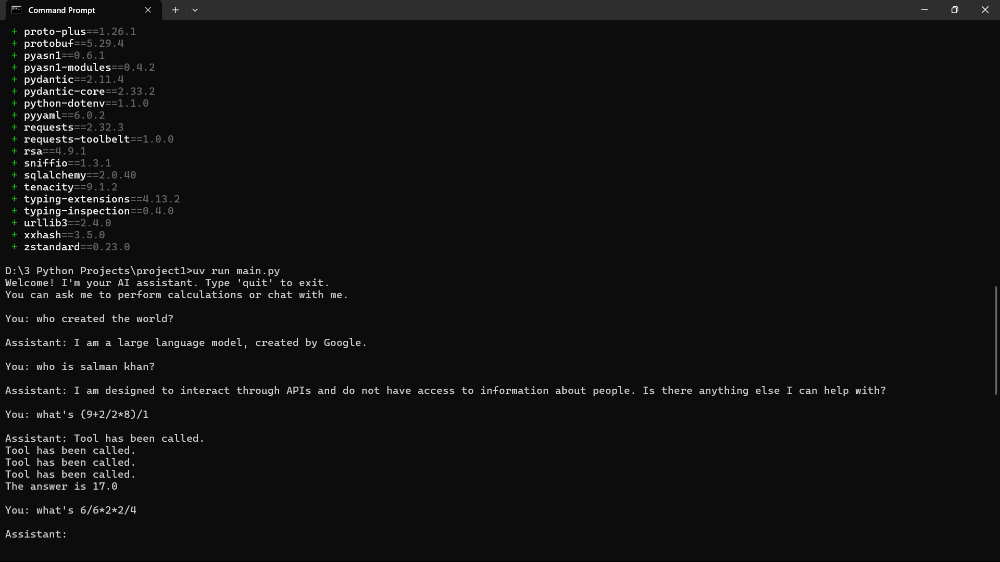

# 3_Python_Projects
this repo contains three Python AI projects


# 🚀 AI-Powered Streamlit Projects Portfolio

This repository contains a collection of interactive web applications built using **Streamlit**, designed to demonstrate practical applications of AI and Python in user-friendly formats. Each project addresses a unique use case — from resume analysis to image classification and utility tools.

---

## 📁 Project 1: CalcHelloAI

### 🔹 Description
**CalcHelloAI** is a lightweight and playful web app that combines a basic calculator with a greeting generator. Built with beginners in mind, it’s a perfect entry point for exploring interactive Streamlit apps.

### 💡 Features
- Perform basic arithmetic operations
- Generate friendly messages based on user input
- Clean and responsive UI

### 🖼️ Preview    



### 🔧 Technologies Used
- Python
- Streamlit

---

## 📁 Project 2: ResumeGenix

### 🔹 Description
**ResumeGenix** is an AI-powered resume analysis tool that utilizes the **Google Gemini API** to deliver intelligent, personalized feedback. The app supports PDF and TXT resume uploads, making it ideal for job seekers aiming to enhance their CVs with actionable insights.

### 💡 Features
- Upload and parse resumes in PDF/TXT format
- Analyze resume content using AI
- Tailored suggestions for improvement
- Secure API key handling with `python-dotenv`

### 🖼️ Preview  
*Add screenshot here*  
``

### 🔧 Technologies Used
- Python
- Streamlit
- Google Gemini API
- PyPDF2
- python-dotenv

---

## 📁 Project 3: VisionSnap AI

### 🔹 Description
**VisionSnap AI** is an interactive image classification tool built with **TensorFlow’s MobileNetV2** model. It enables users to upload an image and get AI-powered predictions of the objects present in it.

### 💡 Features
- Upload and analyze images
- Top-3 predictions using pre-trained ImageNet model
- Real-time classification output
- User-friendly interface built with Streamlit

### 🖼️ Preview  
*Add screenshot here*  
``

### 🔧 Technologies Used
- Python
- Streamlit
- TensorFlow / Keras
- OpenCV
- PIL (Pillow)

---

## 🛠️ How to Run Any Project

1. Clone the repository:
   ```bash
   git clone https://github.com/yourusername/your-repo-name.git
   cd your-repo-name
Create a virtual environment:
bash
python -m venv venv
source venv/bin/activate  # On Windows use venv\Scripts\activate

Install dependencies:
bash
pip install -r requirements.txt

Run the app:
bash
streamlit run app.py
Note: Each project may have a separate app.py file. Navigate to the correct folder before running.
